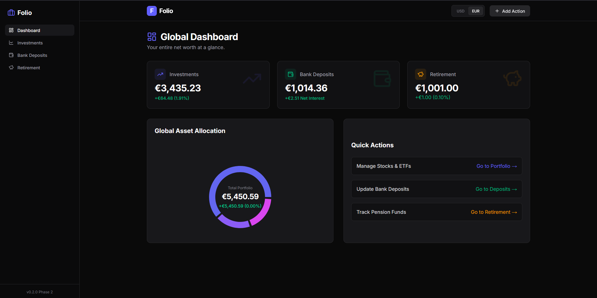
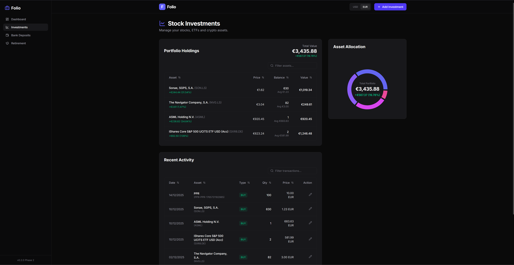
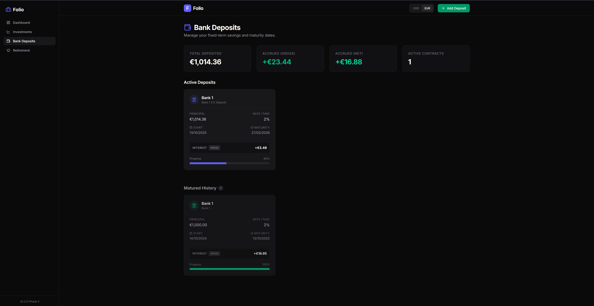
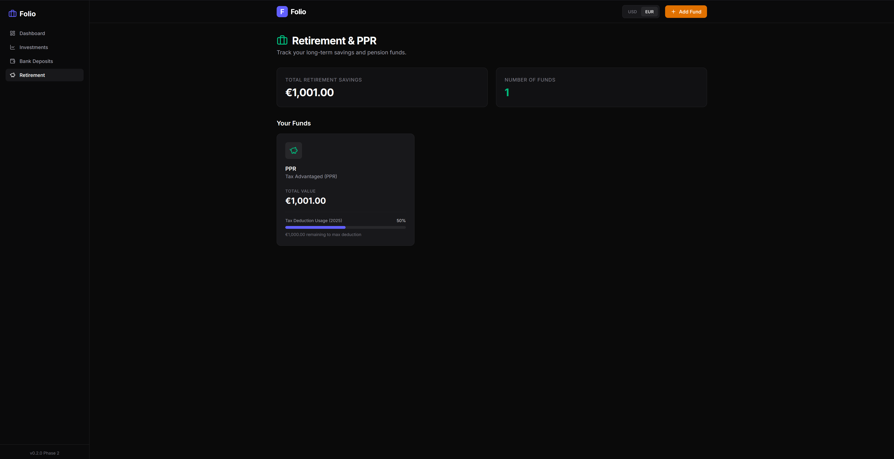

# Folio

Folio is a web application whose primary purpose is to let users track their
personal finances - investiments, banck deposits, and retirment funds - all in
one place. It runs in two modes:

- **Local mode** (default): no login; all data stored locally in a SQLite
  database (`prisma/dev.db`).
- **Cloud mode** (deployed, e.g. on Vercel): sign in with Google; your
  database is a SQLite file stored in a `Folio` folder **in your own Google
  Drive** — the server keeps nothing. See
  [docs/DEPLOYMENT.md](./docs/DEPLOYMENT.md).

This app was constructed using [Google Antigravity](https://antigravity.dev/) IDE.
For real-time stock price updates, it uses the Yahoo Finance API.

## Printscreens


*Figure 1 - Folio main dashboard printscrean*


*Figure 2 - Folio investments dashboard printscrean*


*Figure 3 - Folio bank deposits dashboard printscrean*


*Figure 4 - Folio retirement funds dashboard printscrean*

## Getting Started

First, run the development server:

```bash
npm run dev
# or
yarn dev
# or
pnpm dev
# or
bun dev
```

Open [http://localhost:3000](http://localhost:3000) with your browser to see the result.

You can start editing the page by modifying `app/page.tsx`. The page auto-updates as you edit the file.

This project uses [`next/font`](https://nextjs.org/docs/app/building-your-application/optimizing/fonts) to automatically optimize and load [Geist](https://vercel.com/font), a new font family for Vercel.

## Learn More

To learn more about Next.js, take a look at the following resources:

- [Next.js Documentation](https://nextjs.org/docs) - learn about Next.js features and API.
- [Learn Next.js](https://nextjs.org/learn) - an interactive Next.js tutorial.

You can check out [the Next.js GitHub repository](https://github.com/vercel/next.js) - your feedback and contributions are welcome!

## Deploy on Vercel

Folio deploys to Vercel's free tier with Google sign-in and the database
stored in your own Google Drive. The full step-by-step guide — Google Cloud
OAuth setup, Vercel configuration, and data migration — is in
[docs/DEPLOYMENT.md](./docs/DEPLOYMENT.md).

## Setup

```bash
# Install dependencies
npm install

# Create a fresh SQLite database from the Prisma schema
npx prisma db push   # generates prisma/dev.db

# Run the development server
npm run dev
```
